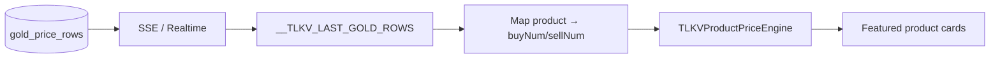
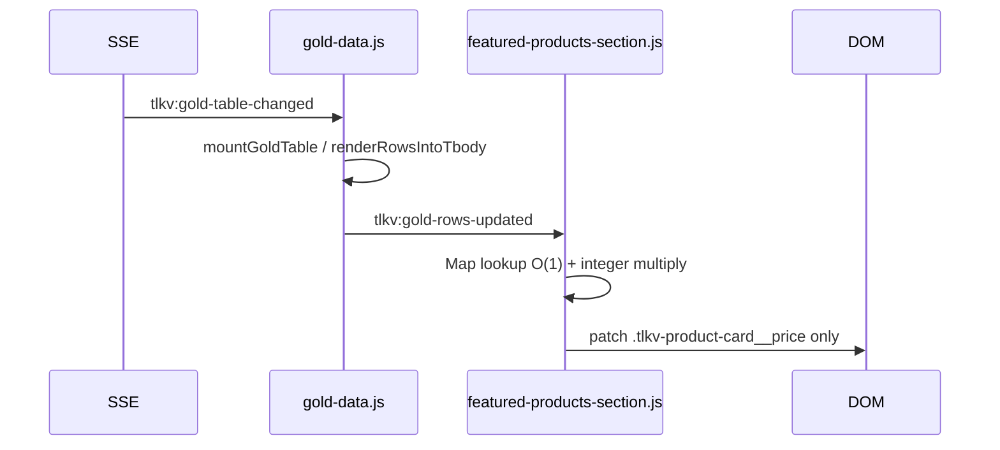

# Derived product pricing (homepage)

## Source of truth

- **Pricing:** `gold_price_rows` only (`product`, `buy`, `sell` → `buyNum` / `sellNum` in client cache).
- **Catalog:** `products.weight` + `products.price_source_product` (mapping only, no stored calculated price).

## Data flow



## Realtime flow



## Lookup

`Map` keyed by exact `gold_price_rows.product` string (= `products.price_source_product`).

Target: **O(1)** per product; rebuild index **O(n)** on gold rows update (n ≈ 12–50).

## Money

- DB prices: integer VND per chỉ.
- Weight: `numeric(5,1)` → scaled to tenths: `(pricePerChi * round(weight*10)) / 10`.
- No float accumulation on totals.

## Debounce

**Not used** for price patches on homepage. SSE is infrequent; patching ≤100 DOM text nodes is cheaper than debounce latency.

Catalog structure refresh (`tlkv:products-changed`) still refetches products from API.

## Config

```js
window.TLKV_PRODUCT_DERIVED_PRICE_SIDE = "sell"; // or "buy"
```

## Modules

| File | Role |
|------|------|
| `js/products/product-price-engine.js` | Domain: index, multiply, format |
| `js/gold-data.js` | Cache + `tlkv:gold-rows-updated` |
| `js/products/featured-products-section.js` | Mount, patch DOM |
| `js/products/catalog-api.js` | Load `weight`, `price_source_product` |
